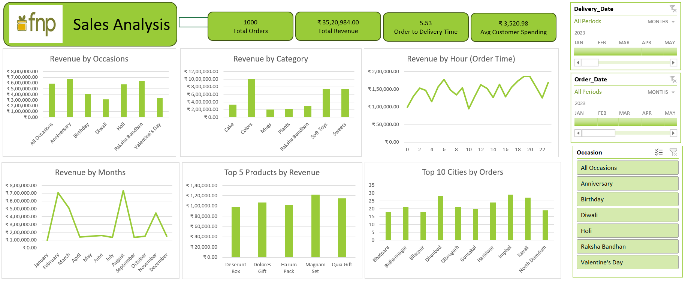

# Sales-Analysis-Dashboard---FNP
This Excel-based BI project analyzes sales data for FNP using Power Query for data cleaning and transformation, Power Pivot for data modeling, and interactive Excel dashboards for visualization. It includes KPIs, trend analysis, and actionable business recommendations.

## 📌 Project Overview
This project is a **Sales Analysis Dashboard** for **FNP**, built entirely in **Microsoft Excel** using **Power Query** for data transformation, **Power Pivot** for data modeling, and interactive charts with slicers for visualization.  

It delivers insights into sales performance, customer behavior, and product demand patterns, enabling data-driven business decisions.

---

## 🔍 Key Features
- **Data Cleaning & Transformation:**  
  - Used **Power Query Editor** to import, clean, and preprocess raw sales data.
- **Data Modeling:**  
  - Built relationships between multiple tables in **Power Pivot** for seamless analysis.
  - Created calculated columns & measures using **DAX**.
- **Interactive Dashboard:**  
  - Slicers for filtering by **Occasion**, **Order Date**, and **Delivery Date**.
  - Dynamic charts and KPIs for quick insights.

---

## 📊 Key Insights
- **Total Orders:** 1,000
- **Total Revenue:** ₹35,20,984
- **Average Delivery Time:** 5.53 days
- **Average Customer Spending:** ₹3,520.98

### Performance Highlights:
1. **Occasions**  
   - Highest: Anniversary & Raksha Bandhan (> ₹7,00,000 revenue)  
   - Lowest: Diwali & Valentine’s Day

2. **Categories**  
   - Top: Colors (~₹10,00,000 revenue)  
   - Low: Mugs & Plants

3. **Time Trends**  
   - Peak hours: 6 AM, 6 PM, and 8 PM

4. **Monthly Revenue**  
   - Highest months: March & August (~₹7,00,000+)  
   - Low months: April, May, June, October

5. **Top Products**  
   - Magnam Set, Quia Gift, Dolores Gift – top revenue generators

6. **Top Cities**  
   - Dhanbad & Kavali lead in total orders

---

## Dashboard Preview
Show what the dashboard looks like. - 

---

## 🛠 Tools & Technologies
- **Microsoft Excel**
- **Power Query Editor** – Data cleaning and transformation
- **Power Pivot** – Data modeling & relationships
- **DAX (Data Analysis Expressions)** – Calculated columns & measures
- **Pivot Tables & Pivot Charts**
- **Slicers & Timelines** – Interactive filtering

---
